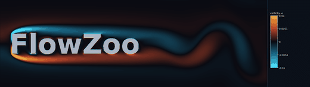
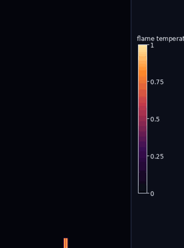
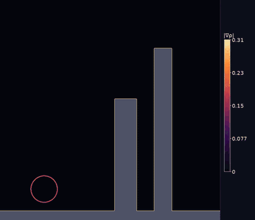
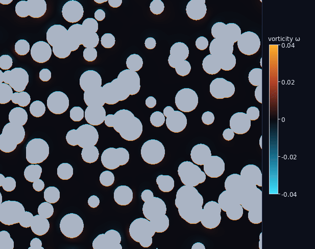
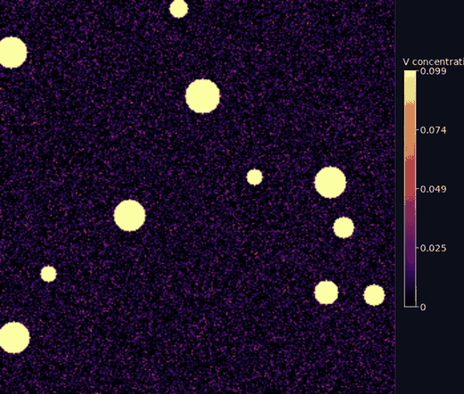

# 🏮 Funoos

### *Where imagination becomes vision.*

**A visual exhibition of worlds in motion — six numerical methods, each written from scratch, each validated against a textbook benchmark, each rendered to be watched.**

Funoos (فانوس — *the lantern of imagination*) shows physics from many angles: kinetic (lattice Boltzmann), continuum (projection Navier–Stokes), compressible (finite-volume shock capturing), meshfree (SPH), spectral (FFT), and pattern-forming (reaction–diffusion). **29 scenes across 6 methods**, browsable in a dark, glassmorphic desktop app — and every solver is checked against an analytical or experimental result.

<p align="center">
  
</p>
<p align="center"><em>The signature scene: type your name and watch the flow braid vortices off the letters (lattice Boltzmann).</em></p>

---

## The methods & scenes

| Method | Scenes |
|---|---|
| **Lattice–Boltzmann** (D2Q9, BGK) | Kármán vortex street · airfoil · **flow around your name** · **F1-car aero** · **cyclist** · **drafting pair** · **flow through porous rock** (measures permeability) |
| **Incompressible Navier–Stokes** (projection) | rising smoke · Rayleigh–Taylor fingers · **candle flame** · **Rayleigh–Bénard convection** · **chimney plume in a crosswind** |
| **Compressible Euler** (finite-volume HLLC) | open-air blast · **shockwave hits a city** (towers crumble) · shock–bubble · twin-bubble |
| **Smoothed-Particle Hydrodynamics** | dam break · droplet crown · sloshing · pouring · ocean swell · **floating ship** (rigid-body FSI) |
| **Pseudo-spectral** (FFT) | Kelvin–Helmholtz billows · decaying 2-D turbulence · **chaotic dye mixing** |
| **Reaction–Diffusion** (Gray–Scott) | Turing patterns: spots · stripes · labyrinth · **mitosis** |

<p align="center">
  
  
  
</p>
<p align="center">
  
  
  
</p>

---

## Validation — every method is checked

| Scene | Method | Benchmark | Result |
|---|---|---|---|
| Vortex street | LBM D2Q9 | Strouhal number (Re ≈ 160) | **St ≈ 0.20** ✓ (live in the player) |
| Sod shock tube | Compressible HLLC | exact Riemann solution | **mean abs error ≈ 0.002** ✓ |
| Kelvin–Helmholtz | Pseudo-spectral | inviscid energy conservation | **drift < 10⁻⁸ (to round-off)** ✓ |
| Porous flow | Pore-scale LBM | Darcy / Kozeny–Carman | **k = ν⟨u⟩/g**, monotonic in porosity ✓ |
| Turing patterns | Gray–Scott | Pearson's regimes | reproduces spots/stripes/maze/mitosis ✓ |
| Dam break | SPH | dry-bed front vs 2√(gH) | front in the physical (Ritter) range ✓ |

These run in `tests/smoke_test.py` (CI): spectral energy, Sod shock, reaction-diffusion bounds, and porous-permeability monotonicity all assert automatically.

---

## Funoos — the app

A **dark glassmorphic desktop app** (HTML/CSS/JS in a [pywebview](https://pywebview.flowrl.com/) shell, with the Python/C++ solvers as the backend):

- **Home** — the brand, the methods, who built it.
- **Gallery** — a **card grid** of all 29 scenes; each card opens a detail page with the clip, the **governing equation**, an undergrad-level write-up, the setup (initial & boundary conditions), and validation.
- **Studio** — a **bento dashboard**: tune every parameter (each scene shows only its relevant controls), **Run once** (with a live progress %), switch visualizations live (vorticity / speed / streamlines / schlieren / …), recolor across palettes, scrub/step/speed the playback, read **live KPI tiles** (e.g. permeability, porosity), and open the **Diagnostic plots** (Strouhal, lift/drag, drafting shelter, convective flux, blast radius, permeability vs Kozeny–Carman — each with an explanation).

### Install & run

**Easiest — Windows installer (no Python, no compiler needed by the user).**
On a Windows machine with `g++` (MSYS2/w64devkit) and Python, run `build_windows.bat`
to produce a standalone `dist\Funoos\Funoos.exe`, then compile `installer.iss` in
[Inno Setup](https://jrsoftware.org/isinfo.php) to get a single **`Funoos-Setup.exe`**.
Hand that file to anyone — they double-click, install, and launch from the Start menu.
(Needs the WebView2 runtime, preinstalled on Windows 10/11.)

**Easiest — macOS app (`.app` / `.dmg`, no Python needed by the user).**
On a Mac, first `brew install python gcc libomp` (gcc/libomp give OpenMP), then:
```bash
./build_mac.sh    # builds the solvers, bundles dist/Funoos.app, and a dist/Funoos.dmg
```
Hand out `Funoos.dmg`; the user drags `Funoos.app` to Applications. It's unsigned, so
the first launch is **right-click ▸ Open** (to get past Gatekeeper).

**From source — one step (Linux / macOS).** Needs Python 3 and an OpenMP `g++`
(Linux: `g++`; macOS: `brew install gcc libomp` — `install.sh` auto-detects it):
```bash
git clone https://github.com/SalehMohammadrezaei/Funoos.git
cd Funoos
./install.sh      # builds the C++ solvers + sets up a local .venv with all deps
./run.sh          # launch the app
```

**From source (any OS, manual).**
```bash
make -C solvers/lbm && make -C solvers/incompressible && make -C solvers/compressible && make -C solvers/sph
pip install -r requirements.txt
python funoos_app.py        # or run.bat on Windows
```

The gallery clips ship in `results/gallery/`; regenerate any time with `python render_gallery.py High 1.8`.

### Command-line demos
Each grid/particle exhibit also has a standalone script that writes a GIF + MP4:
```bash
python demos/flow_around_name.py --text "YourName"     # the signature scene
python demos/vortex_street.py   # ... and smoke_plume, rayleigh_taylor, explosion,
python demos/shock_tube.py      #     shock_bubble, dam_break, turbulence (--quick for fast)
```

## Stack
**C++ + OpenMP** for the four grid/particle solver cores (fast enough on a CPU to run the high resolution that makes the output beautiful) · **Python** (NumPy/SciPy/Pillow/Matplotlib + ffmpeg via imageio-ffmpeg) for the spectral, reaction–diffusion and quantum solvers, the engine, geometry, text→mask, validation, post-processing diagnostics, and a shared cinematic rendering pipeline · **HTML/CSS/JS** UI in pywebview.

## Repository layout
```
funoos_app.py     pywebview app (backend bridge to the solvers)
index.html, web/  the dark glassmorphic UI (CSS + JS, no external libraries)
solvers/          C++ solver cores: lbm/ incompressible/ compressible/ sph/
flowzoo/          engine · catalog · spectral · reaction · quantum · geometry · postproc · render · validate
demos/            one runnable script per grid/particle exhibit
results/gallery/  the gallery clips (GIF + full-res MP4), one per scene
docs/             method notes, equation images, Windows build guide
tests/            smoke + validation suite
studio.py         legacy CustomTkinter desktop app (superseded by funoos_app.py)
```

## License
MIT — see [LICENSE](LICENSE). Built by **Saleh Mohammadrezaei** · salehmrezaee@gmail.com
