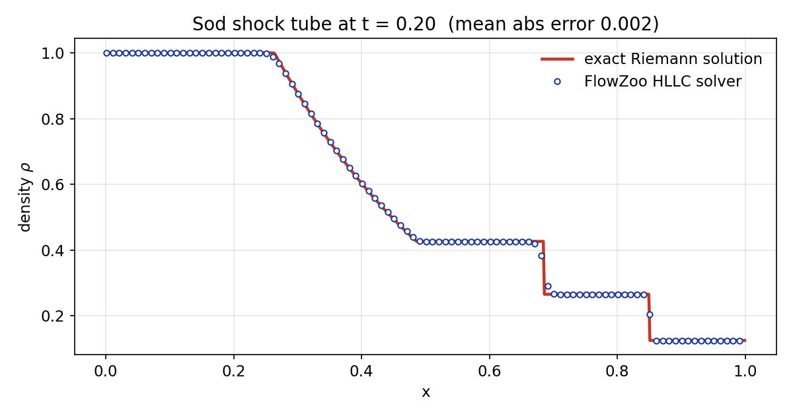

# 🦓 FlowZoo

**A zoo of fluid phenomena — each one solved from scratch with a different numerical method, validated against a textbook benchmark, and rendered as a cinematic animation.**

Most CFD portfolios show one solver run one way. FlowZoo shows fluids from **five** angles — kinetic (lattice Boltzmann), continuum (projection-method Navier–Stokes), compressible (finite-volume shock capturing), meshfree (SPH), and spectral (FFT). Every exhibit is checked against an analytical or experimental benchmark, and every one is built to be *watched*.

<p align="center">
  
</p>
<p align="center"><em>The signature exhibit: type your name and watch the flow shed vortices off the letters (lattice Boltzmann).</em></p>

---

## The exhibits

### 🌀 Kármán vortex street · *Lattice Boltzmann (D2Q9)*

Flow past a cylinder sheds the classic alternating wake. **Validated:** Strouhal number **St = 0.20** at Re ≈ 160 (textbook ≈ 0.2).

### 🔥 Rising smoke plume · *Incompressible Navier–Stokes*

A buoyant, dyed source rises into a swirling turbulent plume. Projection method + Boussinesq buoyancy + vorticity confinement.

### 🍄 Rayleigh–Taylor instability · *Incompressible Navier–Stokes*

Heavy fluid over light under gravity, rolling into mushroom-cap plumes.

### 💥 Explosion / blast wave · *Compressible Euler (HLLC)*

A high-pressure region bursts into an expanding circular shock (schlieren view).

### 🫧 Shock–bubble interaction · *Compressible Euler (HLLC)*

A planar shock sweeps over a light-gas bubble and rolls it into a vortex pair.

### 🌊 Dam break splash · *Smoothed-Particle Hydrodynamics*

A water column collapses and surges across a tank — a meshfree, Lagrangian free-surface flow.

### 🌪️ Kelvin–Helmholtz billows · *Pseudo-spectral (FFT)*

A shear layer rolls up into billows cascading toward 2D turbulence.

---

## Validation (every exhibit is checked)

| Exhibit | Method | Benchmark | Result |
|---|---|---|---|
| Vortex street | LBM D2Q9 | Strouhal number (Re≈160) | **St = 0.20** ✓ |
| Sod shock tube | Compressible HLLC | exact Riemann solution | **mean abs error 0.002** ✓ |
| Kelvin–Helmholtz | Pseudo-spectral | inviscid energy conservation | **drift ≈ 1.5×10⁻⁷** ✓ |
| Dam break | SPH | dry-bed front speed vs 2√(gH) | front ≈ 0.7× Ritter limit (in the physical range) |

<p align="center"></p>
<p align="center"><em>The HLLC solver vs. the exact Sod Riemann solution.</em></p>

## Why each method
- **Lattice Boltzmann** — kinetic/mesoscopic; trivially handles arbitrary geometry (any obstacle mask, even text).
- **Incompressible Navier–Stokes (projection)** — the continuum workhorse: pressure–velocity coupling, buoyancy, scalar transport.
- **Compressible Euler (finite-volume HLLC)** — hyperbolic conservation laws and shock capturing.
- **SPH** — meshfree Lagrangian particles, natural for free surfaces and splashing.
- **Pseudo-spectral (FFT)** — high-accuracy methods for turbulence and instabilities.

## Stack
**C++** (OpenMP) for the four grid/particle solver cores — fast enough on a CPU to run high resolution, which is what makes the output beautiful — and **Python** (NumPy / SciPy / Pillow / Matplotlib + ffmpeg) for the spectral solver, geometry, text→mask, validation, and a shared cinematic rendering pipeline so the whole gallery looks like one product.

## Run it
```bash
# build the C++ solvers (need g++ with OpenMP)
make -C solvers/lbm && make -C solvers/incompressible
make -C solvers/compressible && make -C solvers/sph

# then any exhibit (each writes a GIF + MP4 into results/):
python demos/flow_around_name.py --text "YourName"   # signature
python demos/vortex_street.py
python demos/smoke_plume.py
python demos/rayleigh_taylor.py
python demos/shock_tube.py          # the Sod validation figure
python demos/explosion.py
python demos/shock_bubble.py
python demos/dam_break.py
python demos/turbulence.py
# add --quick to any demo for a fast, low-res smoke test
```

## 🎛️ FlowZoo Studio (interactive app)
One window containing every solver — pick an exhibit, adjust its parameters
(type your own text, set Reynolds number, resolution, duration), hit **Run**,
watch the animation play live, then export a GIF or MP4:
```bash
pip install pillow
python studio.py
```
**Windows users:** either run it under WSL (the window opens via WSLg), or build
a native `.exe` + installer with the included `build_windows.bat` and
`installer.iss`. Full step-by-step: **[docs/windows_build.md](docs/windows_build.md)**.

## Performance
The four grid/particle solvers are **parallelized with OpenMP**; the spectral
solver uses multithreaded FFTs. On the LBM core the throughput scales near-
linearly across a handful of cores (≈56 → 211 MLUPS from 1 → 4 threads). Because
the 2D grids are modest, **~4–16 threads is the sweet spot** — set it explicitly
for best results:
```bash
OMP_NUM_THREADS=8 python demos/vortex_street.py
```
Each exhibit's solve runs in roughly **30 s – 2 min on a normal multi-core
laptop** (no GPU required); GIF encoding is often the slower step.

## Repository layout
```
studio.py     interactive Tkinter control panel (all exhibits, live preview)
solvers/      C++ solver cores: lbm/ incompressible/ compressible/ sph/
flowzoo/      Python: spectral solver, engine, geometry, text→mask, validate, render
demos/        one runnable script per exhibit
results/      the gallery animations (GIF + MP4) and validation figures
docs/         method notes & validation write-ups
```

## License
MIT — see [LICENSE](LICENSE). Built by Saleh Rezaee.
