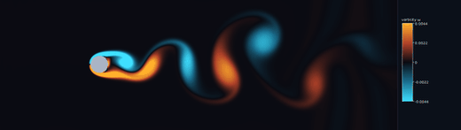
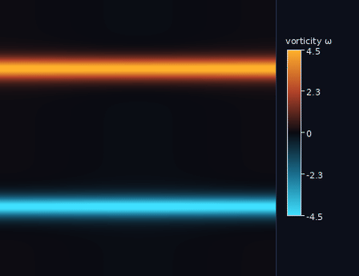

# 🏮 Funoos

### Explore fluid motion through simulation.

Funoos (فانوس — "lantern") is a desktop application for exploring two-dimensional
fluid motion and pattern formation. Choose an experiment, adjust its setup, and
inspect the resulting fields and measurements. Each scene explains its model, its
numerical method and the checks that have been made. It started as a spare-time
project to make computational fluid dynamics easier to *see*; it is now an
interactive laboratory where you can change a setup, compare experiments and
inspect results you can trust — with the limits of every model stated.

Five solvers written from scratch (four in C++/OpenMP, one in Python/FFT) plus a
reaction–diffusion model drive 27 experiments with 48 named presets, organised by
phenomenon: wakes and aerodynamics, porous media, buoyancy and convection, shocks,
free surfaces and waves, vortices and mixing, pattern formation
([docs/gallery_map.md](docs/gallery_map.md)).

<p align="center"> </p>
<p align="center"> </p>

## What you can do

* **Run an experiment** with typed, documented controls (units, recommended ranges,
  solver limits, what is held fixed), see the derived quantities (viscosity, lattice
  Mach number, Rayleigh and Prandtl numbers, particle spacing, post-shock state …)
  and a resource estimate before you start, and cancel a run that is under way.
* **Look at the result** in several views (speed, vorticity, streamlines, schlieren,
  particles …) with a legend that uses the same colour mapping as the field, manual
  colour limits, zoom and pan, frame inspection, point probes and line profiles.
* **Measure**: every scene has diagnostics that state their definition, units, data
  source and sampling; measurements are separated from the plots and exportable as CSV.
* **Compare**: keep a bounded history of runs, pin the ones you want, duplicate a
  setup and change one thing, sweep a parameter over a bounded queue, and view two
  runs side by side synchronised by simulation time with one shared colour scale.
* **Reproduce**: save the complete resolved setup (parameters, derived quantities,
  solver provenance, output times) to a file and load it later; named presets; undo/redo.
* **Understand**: each scene page is layered — what you are seeing, what to try, what
  to observe, the physics, the mathematical model, the actual initial and boundary
  conditions, the numerical method, the checks and limitations, further reading.

## Model checks and limitations

Every scene carries one of three status labels. The checks behind them run in CI
(`tests/`); the numbers below are measured there.

| status | meaning | examples (measured) |
|---|---|---|
| **Analytical comparison** | compared with an exact solution, error reported | Sod shock tube: mean density error 0.0017, velocity 0.0027 at 600 cells (0.003 at 300); Taylor–Green vortex decay: relative error 1e-15; diffusion-only dye stripes vs exp(−2κm²t): 3 %; heated layer with buoyancy off: linear profile, Nu = 1.000; plane-Poiseuille permeability: 0.07 % |
| **Numerical check** | self-consistency, convergence or a documented reference value | cylinder Strouhal number vs the 0.18–0.21 reference range (Williamson 1996); airfoil lift antisymmetric in the angle (C_l(+12°) = +0.41, C_l(−12°) = −0.43); slab sample k_x = 9.2 vs k_y ≈ 0 and k independent of the driving force; still water: residual speed 0.06 m/s, surface at the fill level; spectral energy drift with ν = 0: 2×10⁻⁹ over 200 steps (RK4 truncation, not round-off) |
| **Qualitative demonstration** | shows the phenomenon; no quantitative claim | smoke plume, candle-flame model, blast and buildings, shock–bubble, sloshing, wave tank, floating hull, dye mixing |

What the models do **not** do is stated on each scene page and in
[docs/theory.md](docs/theory.md): the Rayleigh–Taylor scene is a Boussinesq-like
approximation; the candle flame is a simplified model without chemistry; the blast
is a pressure-release model, not a detonation; the buildings are held cells, not true
walls, and their erosion rule is experimental; the hull moves under contact forces
and damping; the wave tank has a flat bottom; the water-blob impact has no surface
tension; the Gray–Scott patterns resemble biological ones without establishing a
mechanism; drag from the wake deficit is an approximation.

## Install and run

**Windows — installer.** Download `Funoos-Setup.exe` from the
[Releases](https://github.com/SalehMohammadrezaei/Funoos/releases) page and check its
SHA-256 against the value listed there. The app is free, open source and not
code-signed, so SmartScreen shows an "unknown publisher" warning the first time:
choose *More info → Run anyway*. Needs the WebView2 runtime (preinstalled on Windows
10/11; the app prints a hint if it is missing). Building the installer yourself:
[docs/windows_build.md](docs/windows_build.md).

**macOS (Apple Silicon) — disk image.** Download `Funoos-macOS-arm64.dmg` and its
checksum from the Releases page, open it and drag Funoos into Applications. It is
built on GitHub's macOS runners by `build_mac.sh` and is not notarized: on first
launch use *right-click → Open → Open*, or `xattr -cr /Applications/Funoos.app`.
Intel Macs: run from source.

**From source (Linux, macOS, Windows).** Python 3.10–3.12 and `g++` with OpenMP.

```bash
git clone https://github.com/SalehMohammadrezaei/Funoos.git && cd Funoos
make -C solvers/lbm && make -C solvers/incompressible && make -C solvers/compressible && make -C solvers/sph
python -m pip install -r requirements.txt     # Linux also needs a GUI backend: python3-gi + gir1.2-webkit2-4.1, or pip install pywebview[qt]
python funoos_app.py                          # ./install.sh + ./run.sh on Linux does the same in a .venv
python funoos_app.py --selftest               # checks solvers, font and encoder without opening a window
```

The gallery clips ship in `results/gallery/`; regenerate with
`python render_gallery.py High 1.8` (exits non-zero if a scene fails).

### Runs, memory and settings

Every Run is a job with an immutable copy of its parameters and an explicit state
(preparing → running → rendering → completed / cancelled / failed). Cancel really
stops the solver. Results are kept in a bounded store: at most `FUNOOS_MAX_RUNS`
(default 3) runs and `FUNOOS_MEMORY_MB` (default 1024) of field data in memory; larger
results are memory-mapped from disk within `FUNOOS_DISK_MB`; the least recently used
unpinned run is released first. Solver threads follow `OMP_NUM_THREADS` (default up to
8). Scratch folders are removed on completion, cancel, failure and exit, and swept
after a crash.

Performance measurements (before/after, same machine) are in
[docs/performance.md](docs/performance.md).

## Command-line demos

```bash
python demos/flow_around_name.py --text "YourName"
python demos/vortex_street.py    # ... smoke_plume, rayleigh_taylor, explosion, shock_bubble, dam_break, turbulence
```

## Stack and layout

Python 3.10–3.12 · NumPy · SciPy · Matplotlib · Pillow · pywebview · ffmpeg (via
imageio-ffmpeg) · C++17/OpenMP solvers.

```
funoos_app.py        desktop app (pywebview shell, job lifecycle, result store, experiments API)
index.html, web/     the UI
flowzoo/             engine (exhibits, runners, Result), schema (parameters), catalog (scene registry),
                     content (physics text), postproc (measurements + plots), analysis (probes/compare),
                     render (colour mapping, encoders), spectral, reaction, geometry, validate
solvers/             lbm2d, ins2d, euler2d, sph2d (C++/OpenMP)
tests/               smoke, numerics, cases, schema, jobs, media suites (all run in CI)
docs/                theory, performance, result schema, testing, Windows build
tools/               pipeline profiler, layout check at eleven window sizes, card thumbnails, walkthrough recorder
studio.py            legacy CustomTkinter UI — unsupported
```

## Citation and licence

MIT (see `LICENSE`; third-party components in `THIRD_PARTY_NOTICES.md`). Created by
Saleh Mohammadrezaei (salehmrezaee@gmail.com). If Funoos is useful in teaching or
research, please cite it (`CITATION.cff`):

> Mohammadrezaei, S. (2026). Funoos — fluid simulation laboratory (version 1.2.0)
> [Computer software]. https://github.com/SalehMohammadrezaei/Funoos

Readability and keyboard access are documented in [docs/accessibility.md](docs/accessibility.md).
